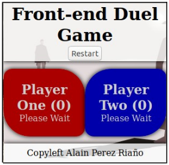
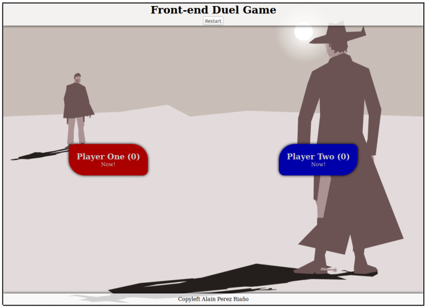
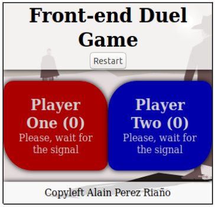
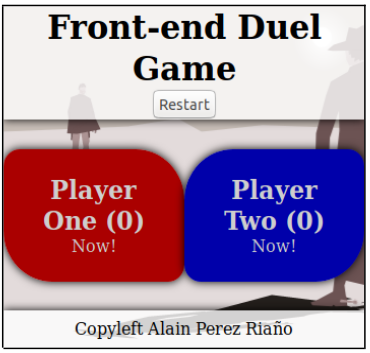
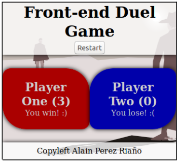
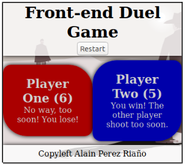

# JavaScript Duel Game

The objective of this exercise is to create a game using just front end technologies. The game
consists of 2 players fighting in duels.

Player One will shoot using F key (from the keyboard) and player two using J key.

## HTML & CSS

* The game should occupy the entire window, no
matter what size it has (unless there is no room
for the content).

*Image 1: Small Screen view.*

*Image 2: Large Screen view.*

* The header and the footer should occupy just the needed space. The players “cards” should
occupy the rest of the height of the page.
* The header, footer and player sections should drop a shadow.
* All texts are centred.
* Players sections should have a title with their punctuation and a text as the output on what
happens in each moment.
* There is a button in the header to restart the game.

## First steps

* Load the JS file in the HTML.
* Call a function that starts the game when the HTML is loaded.
* That function can load each player’s information (the elements that will change during the
game, for example) and will write in their output text to wait for the signal (see image 3).
* Then, add a timeout to call another function when a specific time passes.
* That time will be a random from 2-5 seconds.
* That second function will write “Now!” to both users so they can shoot (see image 3).

*Image 3: Game has started..*

*Image 4: Users can shoot.*

## Enable Shooting

* Add an event that reads users keyboard
clicks.
* When a key is pressed you have to check 2
things
◦ Check if the players are allowed to shoot
(after image 3).
◦ F or J keys are pressed. If another key is
pressed nothing has to happen.
* If both conditions happen, check who wins,
print it and add the result to the scoreboard
(see image 5). Remember to disable shooting
after one of them wins.
* Wait 2 seconds for the users to see the result
and start the game again (random waiting time, enable shooting...).

*Image 5: F key has been pressed before J, so player one wins.*

## User loses if they shoot too soon

* If any of the users clicks a key before they can shoot
(during image 3), the user looses and add.
* If that happens, remember to remove the timeout or it
will write “Now!” when the 2-5 seconds pass and
starting the game again.

*Image 6: Player one shoots too soon.*

## Restarting the game

* When the restart button is pressed, the score should go to 0 and the game must start
removing any pending process, such as timeouts.
* The game must start again then (see image 3).
